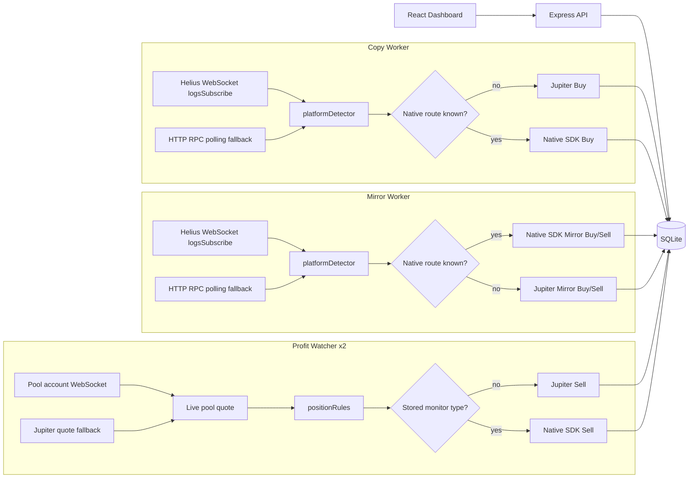

# Solana Copy Trade Bot

Local Solana copy-trading bot with a Node.js backend, SQLite storage, Jupiter plus native DEX execution, Helius WebSocket subscriptions with RPC polling as fallback, and a React/Vite dashboard.

The bot runs locally. It watches enabled trader wallets, detects supported buy transactions, can copy those buys from your local wallet, tracks open positions, and can sell positions automatically by profit, stop-loss, or timeout rules. It also has Mirror mode for full wallet copying: one source wallet can be mirrored so buys open mirror positions and detected source sells close or reduce those mirror positions.

## Current Features

- Backend API on `127.0.0.1:3001` by default.
- React dashboard on `127.0.0.1:5173`.
- SQLite persistence for settings, wallet snapshot, tracked traders, active positions, closed positions, processed signatures, token metadata cache, and bot logs.
- Separate UI controls for auto-buy and auto-sell.
- Copy-trade worker for watching trader wallets through Solana HTTP RPC.
- Profit watcher for open position price checks and auto-sells.
- Manual buy by token mint.
- Manual repeat-buy for tokens that were already traded by the bot.
- Manual sell for open positions.
- Mirror trading for one source wallet with full buy/sell copying.
- Mirror positions page with open and closed mirror positions in one place.
- Mirror analytics separated from regular copy-trading and manual analytics.
- Token metadata endpoint with Helius DAS `getAsset` support for name, symbol, image, decimals, and Token-2022 flag.
- Token icons in positions and manual repeat lists when metadata is available.
- Trading analytics separated from manual token analytics.
- Bot logs with expandable rows, date/time filters, status filter, copy buttons, and delete action.
- Debug logs for buy-like transactions where the source platform was not recognized.
- Jupiter request throttling, retry, and cooldown handling for `429` rate limits.
- Recovery for stale positions stuck in `selling` after a failed auto-sell.
- Recovery for copy-buy transactions that were sent before the active position was written.
- Backend tests for platform detection, state writes, position rules, validation, and token safety helpers.

## Architecture

The project is an npm workspace:

- `backend`: Node.js/TypeScript API, workers, SQLite store, Jupiter, native DEX SDK, Helius, and RPC integrations.
- `frontend`: React/Vite dashboard.

Runtime processes:

- API server: serves state, settings, traders, positions, logs, analytics, manual buy/sell, metadata, and trading controls.
- Copy worker: subscribes to enabled trader wallets via Helius WebSocket (`logsSubscribe`) for push detection; HTTP polling runs in parallel as a fallback. Creates copied buy positions.
- Profit watcher: polls open positions and sells when exit rules trigger.
- Mirror worker: subscribes to one mirror source wallet via WebSocket with polling fallback, copies buy and sell direction.



Both pipelines (WebSocket push and HTTP polling) feed into the same handler. Deduplication is enforced by `processed_signatures` / `mirror_processed_signatures` so overlapping pipelines never double-execute a buy.

The API starts workers as child processes when the dashboard buttons are used.

## Trading Controls

The dashboard has two independent controls:

- `Start buy` / `Stop buy`: starts or stops copy-buy monitoring.
- `Start sell` / `Stop sell`: starts or stops automatic sell monitoring.

Behavior:

- If both are enabled, the bot buys and sells automatically.
- If only buy is enabled, the bot can open new positions but will not auto-sell.
- If only sell is enabled, the bot will not open new copy positions but can close existing open positions.
- If both are disabled, automatic buying and selling are stopped.

Old combined endpoints still exist:

- `POST /api/trading/start`: starts buy and sell.
- `POST /api/trading/stop`: stops buy and sell.

Mirror mode has its own controls:

- `Start mirror` / `Stop mirror`: starts or stops full wallet mirroring.
- Only one mirror source wallet is allowed at a time.
- `SOL per buy` controls the local buy size for mirrored buys; the UI shows the approximate USD conversion.
- Mirror sells follow detected source wallet sells instead of profit-tier rules.

## Supported Source Detection

The copy worker attempts to detect trader buys from these source platforms:

- Raydium AMM / CPMM / CLMM / route
- Orca Whirlpool
- Meteora
- Pump.fun bonding curve
- PumpSwap

Detected source platform is stored on the position as `buyPlatform`.

Execution prefers the native connector when the detector can safely store enough pool or curve data for that venue:

- PumpSwap through the PumpSwap SDK.
- Pump.fun through the Pump.fun SDK / bonding curve path.
- Raydium AMM v4 through the Raydium AMM v4 native path.
- Raydium CPMM / CLMM through `@raydium-io/raydium-sdk-v2`.

When the detector cannot identify a native route, the bot falls back to Jupiter execution.

If a transaction looks like a buy because the trader received a token and spent SOL/WSOL, but no known platform program matched, the bot writes:

- `TRADER_BUY_PLATFORM_UNMATCHED`

That debug log includes the token mint, signature, SOL/WSOL change, token amount, slot, block time, and mentioned programs. Use this to investigate missed Raydium/Meteora/Jupiter-routed trades.

## Copy-Buy Flow

1. Add trader wallets in the dashboard.
2. Enable the traders you want to monitor.
3. Set buy amount in SOL.
4. Click `Start buy`.
5. The copy worker subscribes to each enabled trader through Helius `logsSubscribe` over `WEBSOCKET_ENDPOINT` and pushes new signatures the moment Helius confirms them. HTTP polling through `MAINNET_ENDPOINT` runs in parallel at a slow interval as fallback.
6. For each new signature, it fetches the parsed transaction.
7. If a supported buy is detected, token safety warnings are logged.
8. The bot checks that your wallet has enough SOL for buy amount plus fee reserve.
9. The bot buys through the native venue connector when `monitorType` and pool data are available; otherwise it buys through Jupiter.
10. Token metadata is fetched and cached when possible.
11. An active position is created.

Duplicate copy attempts are prevented through the `processed_signatures` table. If an active position for the same token already exists, the buy is skipped and logged.

If Jupiter sends a buy transaction but the backend crashes or restarts before writing the active position, the recovery logic keeps the buy lock in `tx_sent`, checks transaction meta through RPC, and reconstructs the active position when possible.

## Mirror Full-Copy Flow

Mirror mode copies one source wallet through the same WebSocket + polling fallback pipeline and the same native-first, Jupiter-fallback execution stack.

1. Add one mirror wallet in the Mirror page.
2. Set `SOL per buy`.
3. Click `Start mirror`.
4. The mirror worker subscribes to the source wallet through Helius `logsSubscribe` over `WEBSOCKET_ENDPOINT` and pushes new signatures in real time. HTTP polling through `MAINNET_ENDPOINT` runs in parallel as fallback.
5. If the source wallet buys a supported token, the bot opens a mirror position through the native connector when possible, otherwise through Jupiter.
6. If the source wallet sells a token that has an open mirror position, the bot sells the matching local position through the stored native connector when possible, otherwise through Jupiter.
7. Full source sells close the mirror position; partial source sells reduce the tracked mirror amount.
8. Open and closed mirror positions are shown together on the Mirror page.

Mirror data is stored separately from regular copy-trading:

- `mirror_traders`: the single source wallet and configured buy amount.
- `mirror_positions`: open mirror positions.
- `mirror_closed_positions`: closed mirror positions.
- `mirror_processed_signatures`: mirror buy/sell signatures already handled.

## Sell Flow

1. Click `Start sell`.
2. The profit watcher reads current settings each cycle.
3. It checks every open position through live pool WebSocket prices when native monitoring data is available, otherwise through Jupiter quote pricing.
4. It updates `currentPriceUsd` on the position.
5. It sells through the stored native connector when possible, otherwise through Jupiter, when one of the exit rules triggers.
6. The position is moved from active positions to closed positions.

Exit reasons:

- `take-profit`
- `stop-loss`
- `timeout`
- `manual`

If an auto-sell fails after the position was marked as `selling`, the watcher restores it back to `open` and logs `AUTO_SELL_FAILED`. Stale `selling` positions are also recovered automatically after the configured recovery time.

## Manual Trading

Manual actions use Jupiter execution too:

- `POST /api/swap/buy`: manual buy by token mint.
- `POST /api/swap/repeat-buy`: manual buy for a token that already exists in active or closed positions.
- `POST /api/swap/sell-position`: manual sell of an active position.

Manual positions use:

- `sourceTrader = manual` for manual buy.
- `sourceTrader = manual-repeat` for repeat buy.

Manual analytics are separated from trader copy analytics.

## Analytics

The dashboard analytics page has three modes:

- Trading analytics: copied trader positions only.
- Manual analytics: manual and manual-repeat token positions.
- Mirror analytics: full-copy mirror positions only, shown in SOL terms.

Both tables show trade count, total bought amount, realized/open PnL, win/loss stats, win rate, and average PnL.

Backend endpoints:

- `GET /api/analytics/traders`
- `GET /api/analytics/manual-tokens`
- `GET /api/analytics/mirror-traders`

## Logs

Logs are stored in SQLite and shown in the dashboard.

Supported UI actions:

- filter by date
- filter by time range
- filter by status level
- expand rows for full details
- copy trader/token/signature fields
- delete individual logs

Useful log events include:

- `TRADER_BUY_DETECTED`
- `TRADER_BUY_PLATFORM_UNMATCHED`
- `COPY_BUY_EXECUTED`
- `COPY_BUY_FAILED`
- `COPY_BUY_RECOVERED_FROM_TX`
- `COPY_BUY_RECOVERY_FAILED`
- `BUY_SKIPPED_POSITION_EXISTS`
- `BUY_SKIPPED_INSUFFICIENT_SOL`
- `MANUAL_BUY_EXECUTED`
- `MANUAL_REPEAT_BUY_EXECUTED`
- `MANUAL_SELL_EXECUTED`
- `TOKEN_SAFETY_WARNING`
- `TOKEN_SAFETY_CHECK_FAILED`
- `JUPITER_QUOTE_FAILED`
- `JUPITER_SWAP_FAILED`
- `JUPITER_PRICE_RATE_LIMITED`
- `RPC_REQUEST_FAILED`
- `AUTO_SELL_EXECUTED`
- `AUTO_SELL_FAILED`
- `TAKE_PROFIT_REACHED`
- `STOP_LOSS_REACHED`
- `POSITION_TIMEOUT_REACHED`
- `MIRROR_TRADER_ADDED`
- `MIRROR_TRADER_REMOVED`
- `MIRROR_BUY_EXECUTED`
- `MIRROR_BUY_FAILED`
- `MIRROR_BUY_SKIPPED_POSITION_EXISTS`
- `MIRROR_BUY_SKIPPED_INSUFFICIENT_SOL`
- `MIRROR_SELL_EXECUTED`
- `MIRROR_SELL_MANUAL`
- `MIRROR_SELL_MANUAL_FAILED`

Backend endpoint:

- `GET /api/logs?limit=200`
- `GET /api/logs/events`
- `DELETE /api/logs/:id`
- `DELETE /api/logs`
- `DELETE /api/logs?event=<event>`

## Token Metadata

Token metadata is fetched through Helius DAS using the configured RPC endpoint.

Endpoint:

- `GET /api/tokens/:mint/metadata`

The backend caches metadata in SQLite for six hours. The dashboard uses this data for token names, symbols, images, and Token-2022 visibility.

## Token Safety

Before copy buys, the backend writes warning logs for risky token traits. These warnings do not block the buy.

Current checks include:

- freeze authority
- mint authority
- Token-2022 program
- Token-2022 transfer fee extension
- missing Jupiter buy route
- missing Jupiter sell route
- high round-trip quote loss
- weak liquidity or possible tax behavior
- high price impact

## WebSocket, Polling And Rate Limits

Trader detection runs on two parallel pipelines:

- **Primary**: Helius `logsSubscribe` over `WEBSOCKET_ENDPOINT`. Push notifications arrive within ~100–300ms of block confirmation. Auto-reconnects with exponential backoff (1s → 30s max) and heartbeats every 30s to catch silent disconnects.
- **Fallback**: HTTP RPC polling over `MAINNET_ENDPOINT`. Slow interval (60s+ recommended). Guarantees coverage if the WebSocket connection dies or the host machine sleeps. Both pipelines deduplicate through `processed_signatures` and `mirror_processed_signatures`.

Current defaults / variables:

- WebSocket endpoint: `WEBSOCKET_ENDPOINT` (e.g. `wss://mainnet.helius-rpc.com/?api-key=...`). When unset the workers fall back to polling only.
- Copy worker poll fallback interval: `COPY_TRADE_POLL_MS`, fallback `FREE_MONITOR_POLL_MS`, default `5000`. Recommended `60000` with WebSocket on.
- Copy signature limit: `COPY_TRADE_SIGNATURE_LIMIT`, fallback `FREE_MONITOR_SIGNATURE_LIMIT`, default `20`.
- Profit watcher poll: `PROFIT_WATCHER_POLL_MS`, default `5000`.
- Mirror worker poll fallback interval: `MIRROR_TRADE_POLL_MS`, fallback `COPY_TRADE_POLL_MS`, default `2000`.
- RPC concurrency cap (Helius tier protection): `RPC_MAX_CONCURRENT`, default `3`. Set to `1` on the Free tier.
- Jupiter price cooldown after rate limit: `JUPITER_RATE_LIMIT_COOLDOWN_MS`, default `60000`.
- Jupiter request interval: `JUPITER_REQUEST_INTERVAL_MS`.
- Jupiter request retries: `JUPITER_REQUEST_RETRIES`.
- Jupiter retry-after fallback: `JUPITER_RATE_LIMIT_RETRY_MS`.
- Stale selling recovery: `PROFIT_WATCHER_SELLING_RECOVERY_MS`, default `300000`.

## API Endpoints

Common endpoints:

- `GET /api/health`
- `GET /api/state`
- `GET /api/settings`
- `PUT /api/settings`
- `PATCH /api/settings`
- `GET /api/wallet`
- `PUT /api/wallet`
- `PATCH /api/wallet`
- `GET /api/trading`
- `POST /api/trading/start`
- `POST /api/trading/stop`
- `POST /api/trading/start-copy`
- `POST /api/trading/stop-copy`
- `POST /api/trading/start-profit`
- `POST /api/trading/stop-profit`
- `GET /api/traders`
- `POST /api/traders`
- `PUT /api/traders/:address`
- `PATCH /api/traders/:address`
- `DELETE /api/traders/:address`
- `GET /api/positions/active`
- `POST /api/positions/active`
- `GET /api/positions/active/:id/average-down`
- `PUT /api/positions/active/:id`
- `PATCH /api/positions/active/:id`
- `POST /api/positions/active/:id/close`
- `DELETE /api/positions/active/:id`
- `GET /api/positions/closed`
- `GET /api/swap/pool?tokenMint=<mint>`
- `POST /api/swap/buy`
- `POST /api/swap/repeat-buy`
- `POST /api/swap/sell-position`
- `GET /api/logs?limit=200`
- `GET /api/logs?event=<event>&limit=200`
- `GET /api/logs/events`
- `DELETE /api/logs/:id`
- `DELETE /api/logs`
- `DELETE /api/logs?event=<event>`
- `GET /api/analytics/traders`
- `GET /api/analytics/manual-tokens`
- `GET /api/analytics/mirror-traders`
- `GET /api/analytics/sales?bucket=day`
- `GET /api/analytics/sales?bucket=hour`
- `GET /api/tokens/:mint/metadata`
- `GET /api/manual-tokens`
- `DELETE /api/manual-tokens/:mint`
- `GET /api/blacklist`
- `POST /api/blacklist`
- `DELETE /api/blacklist/:mint`
- `GET /api/mirror/status`
- `POST /api/mirror/start`
- `POST /api/mirror/stop`
- `GET /api/mirror/traders`
- `POST /api/mirror/traders`
- `PATCH /api/mirror/traders/:address`
- `DELETE /api/mirror/traders/:address`
- `GET /api/mirror/positions`
- `GET /api/mirror/positions/closed`
- `POST /api/mirror/positions/:id/sell`

## Environment

Create:

```text
backend/src/helpers/.env
```

Required:

```env
PRIVATE_KEY=your_base58_private_key
MAINNET_ENDPOINT=your_solana_rpc_https_url
```

Optional:

```env
API_HOST=127.0.0.1
API_PORT=3001
RPC_ENDPOINT=
JUPITER_SWAP_API_URL=https://lite-api.jup.ag/swap/v1
JUPITER_PRICE_ENDPOINT=https://lite-api.jup.ag/price/v3
JUPITER_API_KEY=
JUPITER_SLIPPAGE_BPS=200
JUPITER_REQUEST_INTERVAL_MS=2500
JUPITER_REQUEST_RETRIES=1
JUPITER_RATE_LIMIT_RETRY_MS=60000
JUPITER_RATE_LIMIT_COOLDOWN_MS=60000
COPY_TRADE_POLL_MS=1000
COPY_TRADE_SIGNATURE_LIMIT=20
COPY_TRADE_INCLUDE_HISTORY=false
MIRROR_TRADE_POLL_MS=2000
FREE_MONITOR_POLL_MS=
FREE_MONITOR_SIGNATURE_LIMIT=
PROFIT_WATCHER_POLL_MS=10000
PROFIT_WATCHER_SELLING_RECOVERY_MS=300000
```

The env file is ignored by git. Never commit private keys or RPC keys.

## Install

```bash
npm install
```

## Run

Start backend:

```bash
npm run backend
```

Start frontend:

```bash
npm run frontend
```

Run API and frontend together:

```bash
npm run dev
```

Run workers directly:

```bash
npm run worker:copy
npm run worker:mirror
npm run worker:profit
```

URLs:

```text
Frontend: http://127.0.0.1:5173
Backend:  http://127.0.0.1:3001
```

## Checks

Backend tests:

```bash
npm test
```

Backend typecheck:

```bash
npm run typecheck:api
```

Frontend build:

```bash
npm run build:frontend
```

## Requirements

- Node.js `>=24.0.0`
- npm
- Solana HTTP RPC endpoint (and matching WebSocket endpoint for push detection)
- Local trading wallet private key in base58 format

Node 24 is required because the backend uses `node:sqlite`.

## Current Limitations

- Trader monitoring uses Helius WebSocket `logsSubscribe` with HTTP RPC polling as a slow fallback; gRPC / LaserStream streaming is not used (Helius Business tier feature).
- Native execution exists for PumpSwap, Pump.fun, Raydium AMM v4, Raydium CPMM, and Raydium CLMM when enough pool metadata is detected; otherwise execution falls back to Jupiter.
- Jupiter `429` rate limits can still delay fallback buys, fallback price checks, or fallback sells on free/public API tiers.
- Token safety checks are warning-only and do not block copy/mirror buys.
- Honeypot/tax checks are inferred from quotes, not guaranteed simulations.
- Token metadata depends on Helius DAS availability and cache freshness.
- Real trading can lose money because of latency, slippage, failed routes, low liquidity, price impact, and token contract risk.
